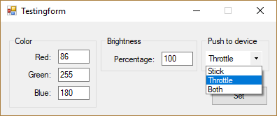

Saitek/Logitech X56 - DirectOutput LED Wrapper
==============================================
This is a constructor to use with the DirectOutput.dll provided with the latest Logitech SDK, ESPECIALLY for setting the LEDs.
This is based on the original Wrapper from https://github.com/nikburnt/saitek-direct-output-csharp-wrapper

### Enjoying this?
Just star the repo or make a donation.

### Setup
* Find an example in the Form1.frm (Testingform)
* Import/add reference X56_Wrapper_x64.dll

### Usage
* Simple straightforward
* Instance the Main Class
* Call instance.Open()
* Call instance.SetLed(device, rgbColor, brightness)
* Call instance.Close()
* No blackmagic, no manual page creation, no payload creation, no manual calculation of RGB to Int32

### Interesting stuff
* RGB to Integer32 formula = (256^2* R) + (256* G) + B

* Integer32 to RGB:
* R = <Integer32>/(256^2)
* G = (<Integer32>/256) % 256
* R = <Integer32>%256

* C++ SetLed index (DirectOutput.dll from SDK) is binary, where 0 is for brightness(max value 100) and 1 for color(int32, max value 16777215[white])

### Contribution
Pull requests are very welcome.

### Copyrights
Saitek/Logitech X56 - DirectOutput LED Wrapper was initially written by **Markus Karl Wackermann**.
